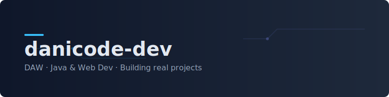

  

  ### \uD83D\uDC4B ¡Hola! Soy Daniel.
  **Desarrollador Web (DAW) · Java Enthusiast · Aprendiendo cada día**

  
  
  

---

### \uD83D\uDEE0\uFE0F Tech Stack

  

---

<!-- PROJECTS:START -->
### \u2B50 Proyectos Destacados (Featured)

| Proyecto | Detalles |
| :--- | :--- |
| **Test_mecagonagrafia** Test de mecanografía minimalista estilo Monkeytype con estadísticas en vivo. | `HTML` `CSS` `JavaScript`   |
| **ahorcado** Ahorcado con versión consola Java + versión web avanzada con modos, logros e historial. | `Java` `HTML` `CSS` `JavaScript`   |
| **FORMULARIO-** Formulario con validación en tiempo real + animación de fondo (Canvas) estilo glassmorphism. | `HTML` `CSS` `JavaScript`   |
<!-- PROJECTS:END -->

  <a href="projects/README.md">Ver todos los proyectos \u2192</a>

---

### \uD83D\uDCC8 GitHub Stats

  
  

 

  Diseñado con \u2764\uFE0F por danicode-dev. <a href="projects/projects.yml">Editar Proyectos</a>

